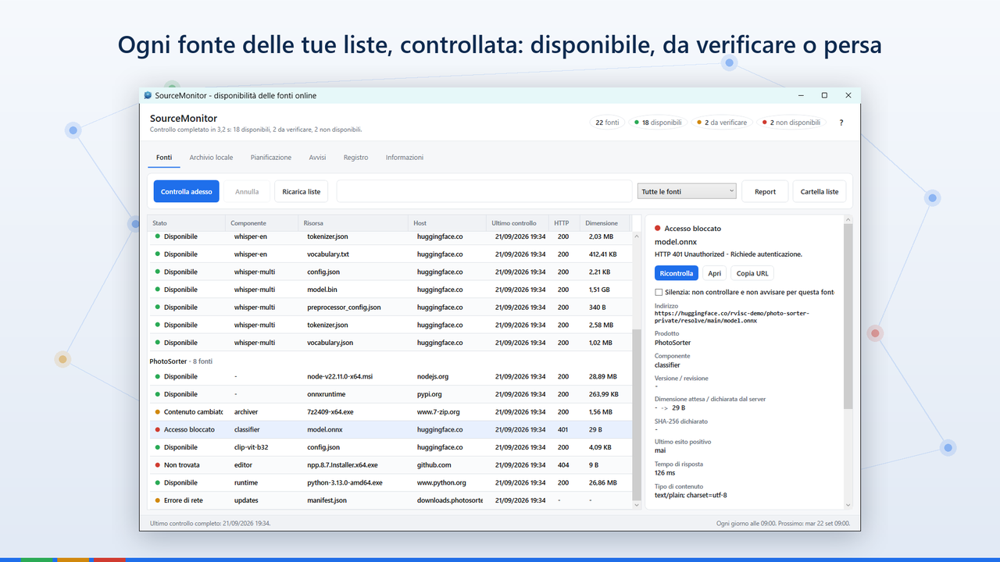
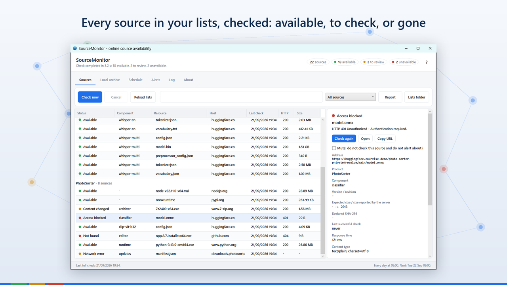
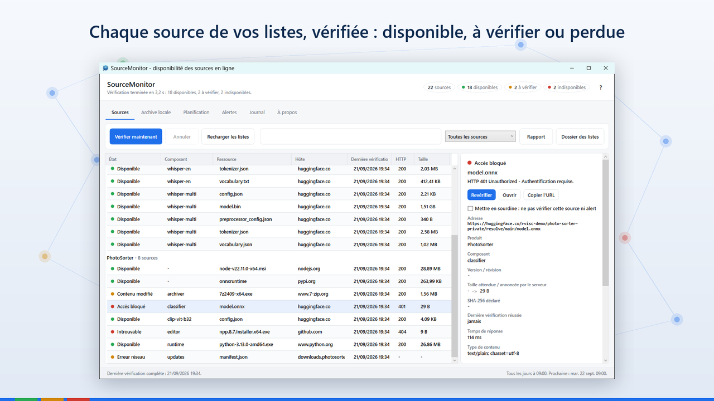
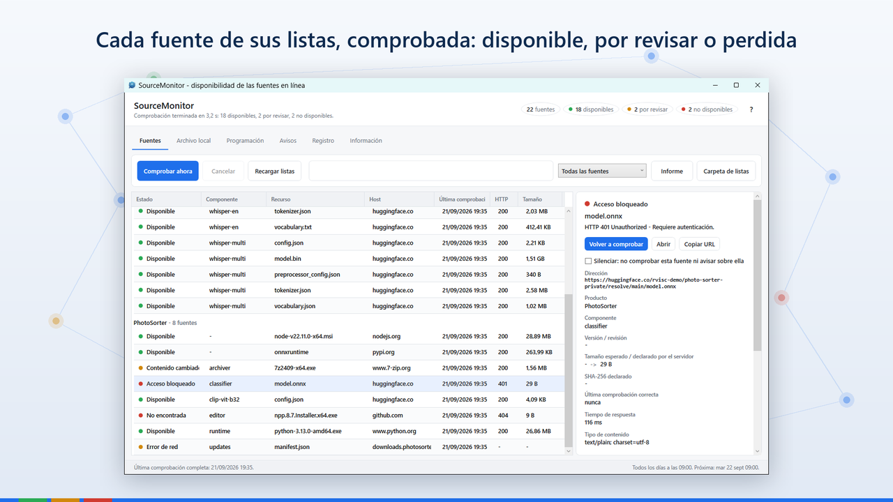
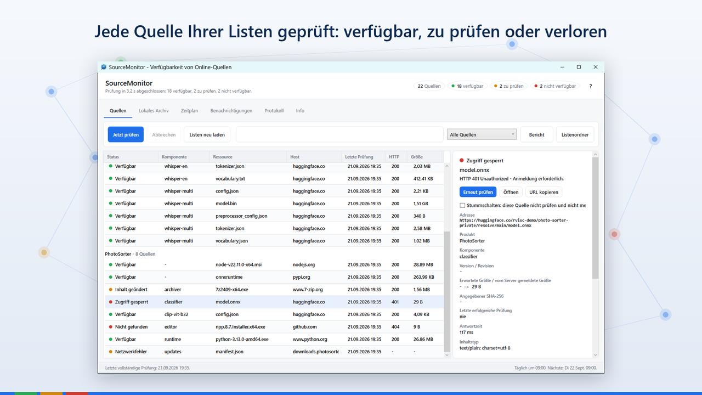
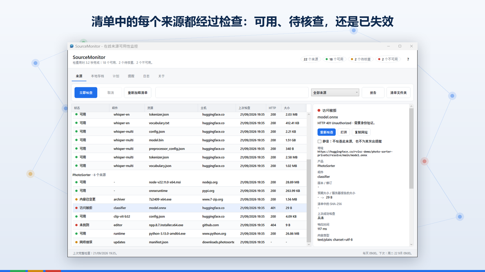

# SourceMonitor

<a href="#it">Italiano</a> ·
<a href="#en">English</a> ·
<a href="#fr">Français</a> ·
<a href="#es">Español</a> ·
<a href="#de">Deutsch</a> ·
<a href="#zh">中文</a>

---

<h2 id="it">Italiano</h2>

Controlla ogni giorno, da solo, che le fonti da cui dipende il tuo software
siano ancora al loro posto. Quando un indirizzo smette di rispondere o un file viene sostituito,
te lo dice.

Pubblichi un programma che alla prima esecuzione scarica modelli, librerie o pacchetti da
Hugging Face, PyPI, GitHub o da qualunque sito. Mesi dopo un repository diventa privato, un file
viene sostituito, un indirizzo smette di rispondere, e te ne accorgi quando te lo segnala un
cliente. SourceMonitor se ne accorge prima.

Metti in una cartella i file .json con gli elenchi delle tue fonti: non c'è un formato da
rispettare, il programma trova da solo ogni indirizzo e usa i campi accanto — versione, sha256,
dimensione — per capire anche se un file è stato cambiato. Scegli quando controllare, e come
essere avvisato: notifica di Windows, colore dell'icona accanto all'orologio, email. Se vuoi, ne
conserva una copia locale, con ripresa dei download e verifica dell'impronta.

Interfaccia, guida e registro in sei lingue. Nessun account, nessuna telemetria, nessuna
pubblicità.

SourceMonitor si collega soltanto agli indirizzi delle liste che gli dai tu
e al server di posta che configuri tu. Non manda niente a noi, in nessuna configurazione.

**Aggiornamenti e sicurezza.** Gli aggiornamenti di sicurezza sono garantiti per cinque anni dalla
data in cui una versione è stata immessa sul mercato. Chi individua una vulnerabilità può scriverne
a <vis-k@outlook.it>: riceve conferma della segnalazione e viene tenuto informato. Chi segnala in
buona fede, senza divulgare il problema prima che sia corretto, non ha niente da temere.

<a href="https://apps.microsoft.com/detail/9PF8QJB99BJ9">Microsoft Store</a>
· <a href="privacy.html#it">Privacy</a>
· <a href="eula.html#it">Contratto</a>

---

<h2 id="en">English</h2>

Checks every day, on its own, that the sources your software depends on are
still in place. When an address stops responding or a file is replaced, it tells you.

You ship a program that downloads models, libraries or packages from Hugging Face, PyPI, GitHub or
any website on its first run. Months later a repository goes private, a file is replaced, an
address stops responding, and you find out when a customer tells you. SourceMonitor finds out
first.

Put the .json files listing your sources in a folder: there is no format to follow, the program
finds every address by itself and uses the fields around it — version, sha256, size — to tell
whether a file has changed too. Choose when to check, and how to be alerted: a Windows
notification, the colour of the icon next to the clock, e-mail. If you like, it keeps a local copy,
with resumable downloads and fingerprint checks.

Interface, help and log in six languages. No account, no telemetry, no advertising.

SourceMonitor connects only to the addresses in the lists you give it and to
the mail server you configure. It sends nothing to us, in any configuration.

**Updates and security.** Security updates are provided for five years from the date a version was
placed on the market. Anyone who finds a vulnerability can write to <vis-k@outlook.it>: they get an
acknowledgement and are kept informed. Anyone reporting in good faith, without disclosing the
problem before it is fixed, has nothing to fear.

<a href="https://apps.microsoft.com/detail/9PF8QJB99BJ9">Microsoft Store</a>
· <a href="privacy.html#en">Privacy</a>
· <a href="eula.html#en">Licence</a>

---

<h2 id="fr">Français</h2>

Vérifie chaque jour, tout seul, que les sources dont dépend votre logiciel sont
toujours en place. Quand une adresse ne répond plus ou qu'un fichier est remplacé, il vous le
dit.

Vous publiez un programme qui, à son premier lancement, télécharge des modèles, des bibliothèques
ou des paquets depuis Hugging Face, PyPI, GitHub ou n'importe quel site. Des mois plus tard, un
dépôt devient privé, un fichier est remplacé, une adresse ne répond plus, et vous l'apprenez quand
un client vous le signale. SourceMonitor le remarque avant.

Placez dans un dossier les fichiers .json qui listent vos sources : aucun format n'est imposé, le
programme trouve tout seul chaque adresse et utilise les champs voisins — version, sha256, taille —
pour savoir aussi si un fichier a changé. Choisissez quand vérifier, et comment être averti :
notification de Windows, couleur de l'icône près de l'horloge, courriel. Si vous le souhaitez, il en
garde une copie locale, avec reprise des téléchargements et vérification de l'empreinte.

Interface, aide et journal en six langues. Aucun compte, aucune télémétrie, aucune publicité.

SourceMonitor se connecte uniquement aux adresses des listes que vous lui
fournissez et au serveur de messagerie que vous configurez. Il ne nous envoie rien, dans aucune
configuration.

**Mises à jour et sécurité.** Les mises à jour de sécurité sont assurées pendant cinq ans à compter
de la date de mise sur le marché d'une version. Qui découvre une vulnérabilité peut écrire à
<vis-k@outlook.it> : un accusé de réception est envoyé et la personne est tenue informée. Qui
signale de bonne foi, sans divulguer le problème avant sa correction, n'a rien à craindre.

<a href="https://apps.microsoft.com/detail/9PF8QJB99BJ9">Microsoft Store</a>
· <a href="privacy.html#fr">Privacy</a>
· <a href="eula.html#fr">Contrat</a>

---

<h2 id="es">Español</h2>

Comprueba cada día, por sí solo, que las fuentes de las que depende su software
siguen en su sitio. Cuando una dirección deja de responder o un archivo se sustituye, se lo
dice.

Publica un programa que, en su primera ejecución, descarga modelos, bibliotecas o paquetes de
Hugging Face, PyPI, GitHub o de cualquier sitio web. Meses después un repositorio pasa a ser
privado, un archivo se sustituye, una dirección deja de responder, y se entera cuando se lo dice un
cliente. SourceMonitor se entera antes.

Coloque en una carpeta los archivos .json con las listas de sus fuentes: no hay un formato que
respetar, el programa encuentra por sí solo cada dirección y usa los campos que la acompañan —
versión, sha256, tamaño — para saber también si un archivo ha cambiado. Elija cuándo comprobar y
cómo recibir los avisos: notificación de Windows, color del icono junto al reloj, correo
electrónico. Si lo desea, conserva una copia local, con reanudación de descargas y comprobación de
la huella.

Interfaz, ayuda y registro en seis idiomas. Sin cuenta, sin telemetría, sin publicidad.

SourceMonitor se conecta solo a las direcciones de las listas que usted le da y
al servidor de correo que usted configura. No nos envía nada, en ninguna configuración.

**Actualizaciones y seguridad.** Las actualizaciones de seguridad están garantizadas durante cinco
años desde la fecha en que una versión se introdujo en el mercado. Quien detecte una vulnerabilidad
puede escribir a <vis-k@outlook.it>: recibe confirmación y se le mantiene al tanto. Quien informa de
buena fe, sin divulgar el problema antes de que esté corregido, no tiene nada que temer.

<a href="https://apps.microsoft.com/detail/9PF8QJB99BJ9">Microsoft Store</a>
· <a href="privacy.html#es">Privacy</a>
· <a href="eula.html#es">Contrato</a>

---

<h2 id="de">Deutsch</h2>

Prüft jeden Tag von selbst, ob die Quellen, von denen Ihre Software abhängt,
noch an ihrem Platz sind. Antwortet eine Adresse nicht mehr oder wird eine Datei ersetzt, sagt es
Ihnen Bescheid.

Sie veröffentlichen ein Programm, das beim ersten Start Modelle, Bibliotheken oder Pakete von
Hugging Face, PyPI, GitHub oder einer beliebigen Website lädt. Monate später wird ein Repository
privat, eine Datei wird ersetzt, eine Adresse antwortet nicht mehr, und Sie erfahren es, wenn ein
Kunde es meldet. SourceMonitor bemerkt es vorher.

Legen Sie die .json-Dateien mit Ihren Quellen in einen Ordner: es gibt kein vorgeschriebenes Format,
das Programm findet jede Adresse von selbst und nutzt die Felder daneben — Version, sha256, Größe —,
um auch zu erkennen, ob eine Datei geändert wurde. Wählen Sie, wann geprüft wird und wie Sie
benachrichtigt werden: Windows-Benachrichtigung, Farbe des Symbols neben der Uhr, E-Mail. Auf
Wunsch bewahrt es eine lokale Kopie auf, mit fortsetzbaren Downloads und Prüfung des
Fingerabdrucks.

Oberfläche, Hilfe und Protokoll in sechs Sprachen. Kein Konto, keine Telemetrie, keine Werbung.

SourceMonitor verbindet sich nur mit den Adressen der Listen, die Sie ihm
geben, und mit dem Mailserver, den Sie einrichten. Es sendet in keiner Konfiguration etwas an
uns.

**Aktualisierungen und Sicherheit.** Sicherheitsaktualisierungen werden fünf Jahre ab dem Tag
bereitgestellt, an dem eine Version in Verkehr gebracht wurde. Wer eine Sicherheitslücke findet,
kann an <vis-k@outlook.it> schreiben: Der Eingang wird bestätigt und über den weiteren Verlauf wird
informiert. Wer in gutem Glauben meldet, ohne das Problem vor seiner Behebung offenzulegen, hat
nichts zu befürchten.

<a href="https://apps.microsoft.com/detail/9PF8QJB99BJ9">Microsoft Store</a>
· <a href="privacy.html#de">Privacy</a>
· <a href="eula.html#de">Vertrag</a>

---

<h2 id="zh">中文</h2>

每天自动检查你的软件所依赖的来源是否仍然可用。一旦某个网址不再响应或某个文件被替换，它会告诉你。

你发布了一个程序，它在首次运行时从 Hugging Face、PyPI、GitHub 或任何网站下载模型、库或软件包。几个月后，某个仓库变成了私有，某个文件被替换，某个网址不再响应，而你要等到客户告诉你才知道。SourceMonitor 会先一步发现。

把列有你的来源的 .json 文件放进一个文件夹：没有必须遵守的格式，程序会自行找出每一个网址，并利用旁边的字段——版本、sha256、大小——判断文件是否被更改。选择何时检查以及如何提醒：Windows 通知、时钟旁图标的颜色、电子邮件。如果愿意，它还会保存一份本地副本，支持断点续传和指纹校验。

界面、帮助和日志支持六种语言。无需账户，没有遥测，没有广告。

SourceMonitor 只连接你提供的清单中的网址和你配置的邮件服务器。在任何配置下都不会向我们发送任何内容。

**更新与安全。** 安全更新自某一版本投放市场之日起提供五年。发现安全漏洞的人可以写信到
<vis-k@outlook.it>：你会收到确认，并被告知处理的进展。善意报告、并且在漏洞修复前不予公开的人，
不必有任何顾虑。

<a href="https://apps.microsoft.com/detail/9PF8QJB99BJ9">Microsoft Store</a>
· <a href="privacy.html#zh">Privacy</a>
· <a href="eula.html#zh">许可协议</a>

---

Rosario Viscardi — <vis-k@outlook.it>

&copy; 2026 Vis-K
